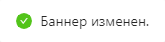

1. [Просмотр списка баннеров](#просмотр-списка-баннеров)
	1. [Просмотр списка баннеров клуба](#просмотр-списка-баннеров-winline)
	2. [Просмотр списка баннеров клубов](#просмотр-списка-баннеров-клубов)
2. [Просмотр информации о баннере](#просмотр-информации-о-баннере)
3. [Создание баннера](#создание-баннера)
4. [Редактирование баннера](#редактирование-баннера)
5. [Удаление баннера](#удаление-баннера)

# Просмотр списка баннеров
Для того чтобы перейти к списку баннеров необходимо в боковом меню нажать на раздел «Реклама».  
Список баннеров разделен на 2 вкладки - Клуб и Winline.

## Просмотр списка баннеров клуба 
Список баннеров клуба представлен в виде таблицы (Рисунок 1) с параметрами:
- Название
- Место размещения
- Статус
- Дата старта
- Дата конца
- Действие:
	- Изменить
	- Удалить

*скрин banners_1*

Рисунок 1

Список можно отфильтровать по Названию и Статусу.

Отсортировать список можно по параметрам:
- Место размещения
- Дата старта
- Дата конца

## Просмотр списка баннеров Winline
Также из админ. панели можно просматривать список баннеров Winline.
На вкладке "Winline" отображается список баннеров, синхронизированный из админ. панели Winline.

После добавления баннеров в админ. панели Winline данные синхронизируются и на вкладке "Winline" в админ. панели Краснодара (Рисунок 2) отобразится список баннеров.

Рисунок 2

Баннера Winline недоступны для редактирования и удаления.

# Просмотр информации о баннере
Чтобы посмотреть информацию о баннере необходимо нажать на его Название.  
После этого откроется карточка для просмотра деталей выбранного баннера (Рисунок 3).

Рисунок 3

# Создание баннера
Для создания баннера необходимо выполнить следующие шаги:
1. На странице просмотра списка баннеров клуба нажать кнопку "Создать" (Рисунок 4)

   *скрин banners_4*
   
   Рисунок 4  
2. В открывшемся окне заполнить поля формы создания (Рисунок 5).

   
   
   Рисунок 5
   
   После заполнения поля "Период отображения баннера" в форме создания становится доступно для выбора "Место размещения" баннера.
   В данном списке отображается список мест размещения с указанием количества размещенных баннеров. Если количество размещенных баннеров на место максимальное, то добавить новый баннер на данное место нельзя (Рисунок 6).

   
   
   Рисунок 6  
3. После заполнения всех полей для создания баннера необходимо нажать кнопку "Сохранить".

После успешного сохранения отобразится уведомление, подтверждающее создание баннера (Рисунок 7).

Рисунок 7

В списке баннеров добавится новая запись с созданным баннером в статусе "запланировано".
При наступлении начала периода отображения баннера статус сменится на "опубликовано".
После окончания периода отображения баннера статус сменится на "скрыто".

# Редактирование баннера
Для редактирования баннера необходимо выполнить следующие шаги:
1. Нажать кнопку "Изменить" напротив необходимого баннера на странице просмотра списка баннеров клуба (Рисунок 8).
   
   *скрин banners_8*
   
   Рисунок 8  
2. В открывшемся окне отредактировать необходимые поля и нажать кнопку «Сохранить» (Рисунок 9).

   *скрин banners_9*
   
   Рисунок 9
   
   Если дата начала отображения баннера меньше текущей даты, то сохранить изменения нельзя. Система выведет соответствующее уведомление (Рисунок 10).

   
   
   Рисунок 10  
3. Подтвердить внесенные изменения в появившемся окне (Рисунок 11).

   *скрин banners_11*
   
   Рисунок 11

После подтверждения внесенных изменений отобразится уведомление, подтверждающее изменение баннера (Рисунок 12).

Рисунок 12

# Удаление баннера
Для удаления сотрудника необходимо выполнить следующие шаги:
1. Нажать на кнопку "Удалить" напротив необходимого баннера на странице просмотра списка баннеров клуба (Рисунок 13).

   *скрин banners_13*
   
   Рисунок 13  
2. В открывшемся модальном окне нажать "Подтвердить" (Рисуноок 14).

   *скрин banners_14*
   
   Рисунок 14

После успешного удаления отобразится подтвержждающее уведомление (Рисунок 15).

Рисунок 15

