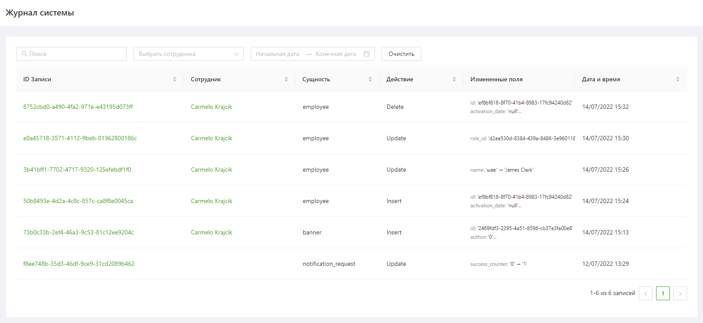
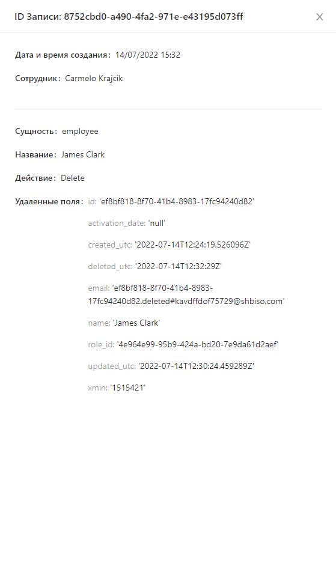
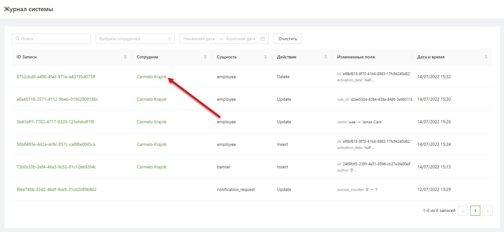
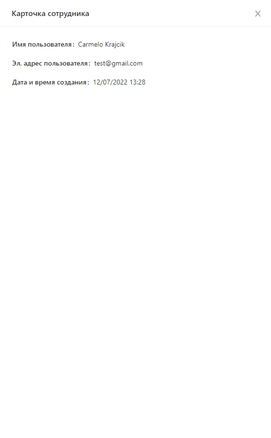

1. [Просмотр списка действий сотрудников](#просмотр-списка-действий-сотрудников)
2. [Просмотр записи действия](#просмотр-записи-действия)
3. [Просмотр информации о сотруднике](#просмотр-информации-о-сотруднике)

# Просмотр списка действий сотрудников
Для того чтобы перейти к списку действий сотрудников необходимо в боковом меню нажать на раздел «Журнал системы».

Список действий сотрудников представлен в виде таблицы (Рисунок 1) с параметрами:
- ID записи
- Сотрудник
- Сущность
- Действие
- Измененные поля
- Дата и время

Рисунок 1

Список действий сотрудников можно отфильтровать по параметрам:
- ID записи (полное совпадение)
- Сотрудник
- Период

Отсортировать список можно по параметрам:
- ID записи
- Сотрудник
- Сущность
- Действие
- Дата и время

# Просмотр записи действия
Чтобы посмотреть информацию о записи действия сотрудника необходимо нажать на ID записи.
После этого откроется карточка для просмотра деталей выбранной записи (Рисунок 2).

Рисунок 2

# Просмотр информации о сотруднике
Чтобы посотреть информацию о сотруднике выполнившем действие необходимо нажать на имя сотрудника в списке действий (Рисунок 3).

Рисунок 3

После этого откроется карточка с информацией о сотруднике (Рисунок 4).

Рисунок 4
