1. [Просмотр списка уведомлений](#просмотр-списка-уведомлений)
	1. [Просмотр ожидающих уведомлений](#просмотр-ожидающих-уведомлений)
	2. [Просмотр истории уведомлений](#просмотр-истории-уведомлений)
2. [Просмотр информации об уведомлении](#просмотр-информации-об-уведомлении)
3. [Создание уведомления](#создание-уведомления)
4. [Редактирование уведомления](#редактирование-уведомления)
5. [Удаление уведомления](#удаление-уведомления)

# Просмотр списка уведомлений
Для того чтобы перейти к списку уведомлений необходимо в боковом меню нажать на раздел «Пользователи» и в раскрывшемся списке выбрать «Уведомления».
Список уведомлений разделен на 2 вкладки - Ожидают и История.

## Просмотр ожидающих уведомлений
Список ожидающих уведомлений представлен в виде таблицы (Рисунок 1) с параметрами:
- ID уведомления
- Заголовок
- Текст
- Проект
- Тип
- Дата и время отправки
- Действие:
	- Изменить
	- Удалить

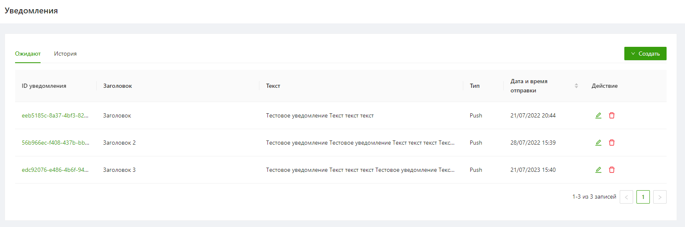

Рисунок 1

Список можно отсортировать по дате и времени отправки.

## Просмотр истории уведомлений
Список ожидающих уведомлений представлен в виде таблицы (Рисунок 2) с параметрами:
- ID уведомления
- Заголовок
- Текст
- Проект
- Тип
- Дата и время отправки
- Отправлено

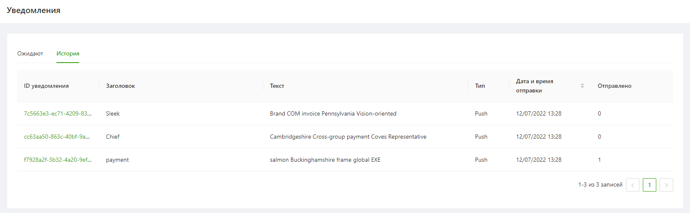

Рисунок 2

Список можно отсортировать по дате и времени отправки.

# Просмотр информации об уведомлении
Чтобы посмотреть информацию об уведомлении необходимо нажать на ID уведомления.  
После этого откроется карточка для просмотра деталей выбранного уведомления (Рисунок 3).

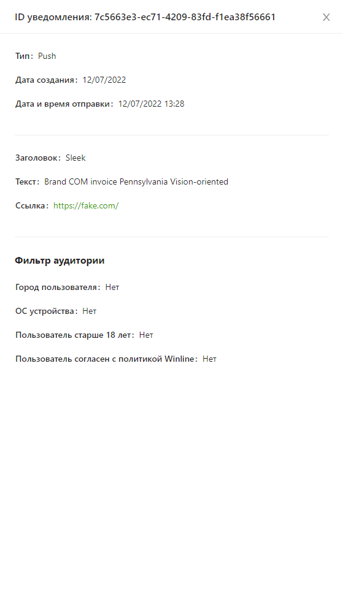

Рисунок 3

# Создание уведомления
Для создания уведомления необходимо выполнить следующие шаги:
1. Перейти на вкладку "Ожидают", нажать на кнопку "Создать" и выбрать в выпадающем списке тип уведомления (Рисунок 4):
   - Push

   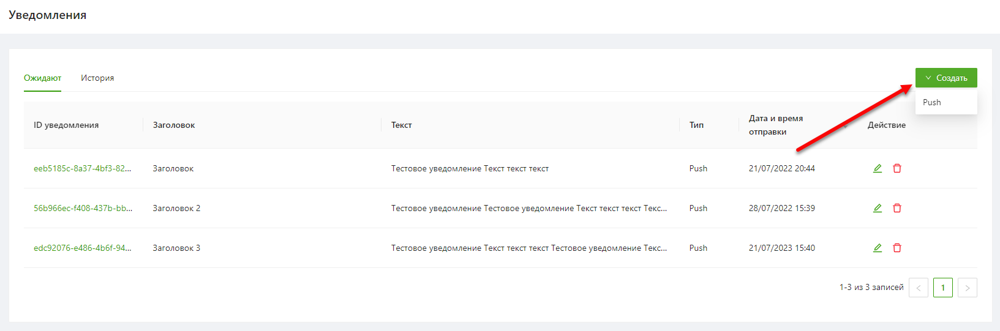
   
   Рисунок 4     
2. В открывшейся форме (Рисунок 5) заполнить обязательные поля и нажать "Сохранить".

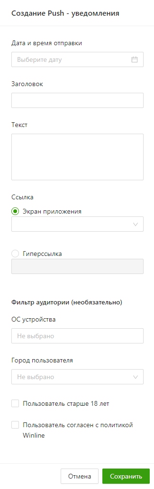

Рисунок 5

После успешного сохранения отобразится уведомление, подтверждающее создание уведомления (Рисунок 6).

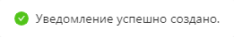

Рисунок 6

Созданное уведомление добавляется в список ожидающих уведомлений.
При наступлении даты и времени отправки уведомление переходит в список истории уведомлений.

# Редактирование уведомления
Для редактирования доступны только уведомления ожидающие отправки.
Для редактирования уведомления необходимо выполнить следующие шаги:
1. Нажать на кнопку "Изменить" напротив необходимого уведомления в списке уведомлений на вкладке "Ожидают" (Рисунок 7).

   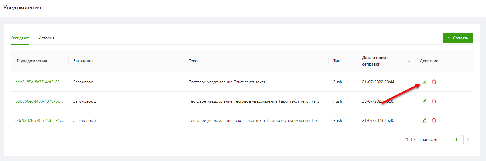
   
   Рисунок 7     
2. В открывшемся окне (Рисунок 8) отредактировать необходимые поля и нажать кнопку «Сохранить».
   
   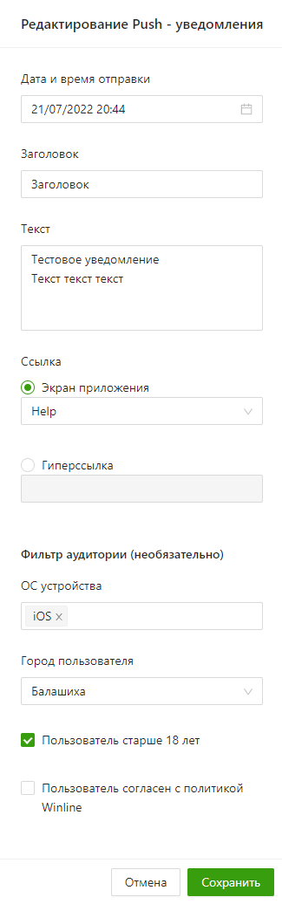

   Рисунок 8

После успешного сохранения отобразится уведомление, подтверждающее изменение уведомления (Рисунок 9).

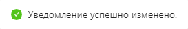

Рисунок 9

Если в момент редактирования наступило время отправки уведомления и оно уже было отправлено, то при попытке сохранить изменения отобразится ошибка (Рисунок 10).

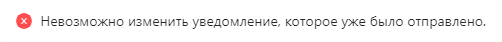

Рисунок 10

# Удаление уведомления
Удалять можно только уведомления ожидающие отправки.

Для удаления уведомления необходимо выполнить следующие шаги:
1. Нажать на кнопку "Удалить" напротив необходимого уведомления в списке уведомлений на вкладке "Ожидают" (Рисунок 11).
   
   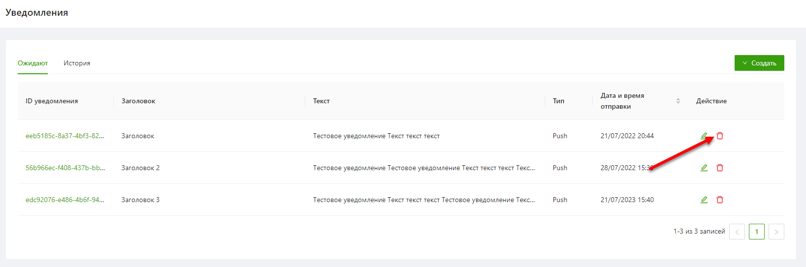
   
   Рисунок 11     
2. В открывшемся модальном окне нажать "Подтвердить" (Рисунок 12).

   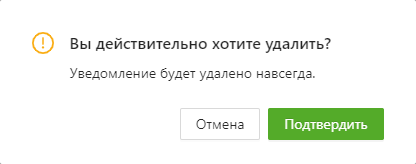
   
   Рисунок 12

После успешного удаления отобразится подтвержждающее уведомление (Рисунок 13).

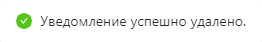

Рисунок 13

Уведомление, которое уже было отправлено, но еще отображается на вкладке "Ожидают" (если во время просмотра списка уведомлений на вкладке "Ожидают" наступоло время отправки уведомления) удалить нельзя.
При попытке удалить таккое уведомление отобразится уведомление (Рисунок 14):

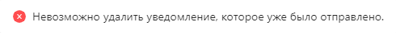

Рисунок 14