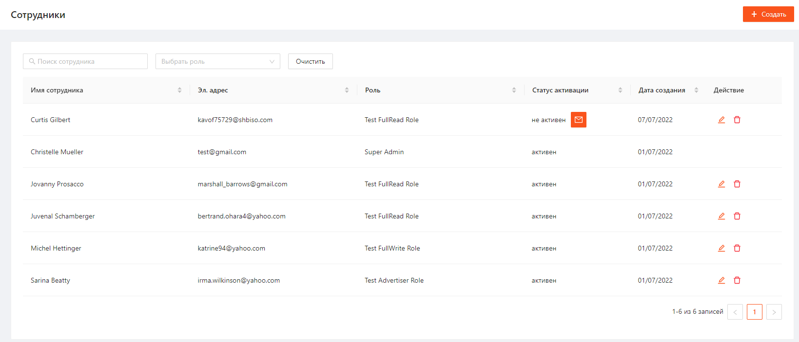
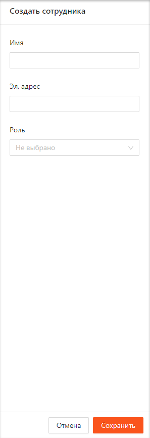
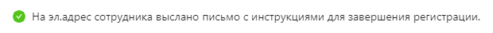
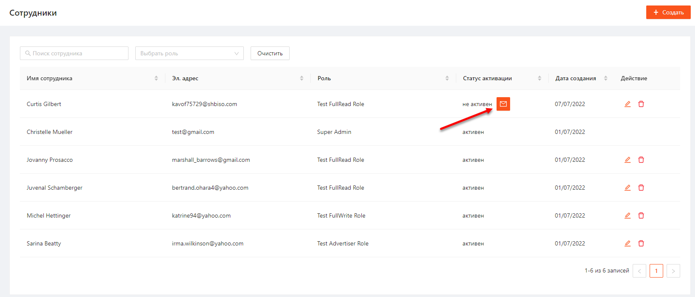
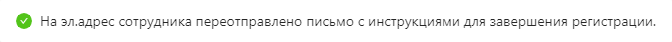
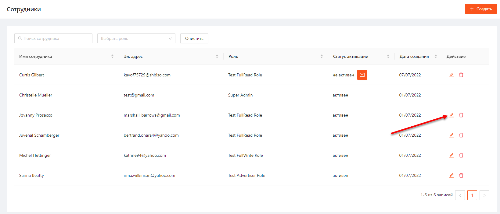
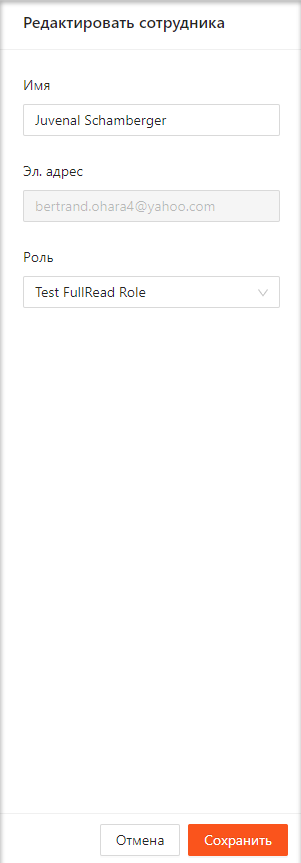
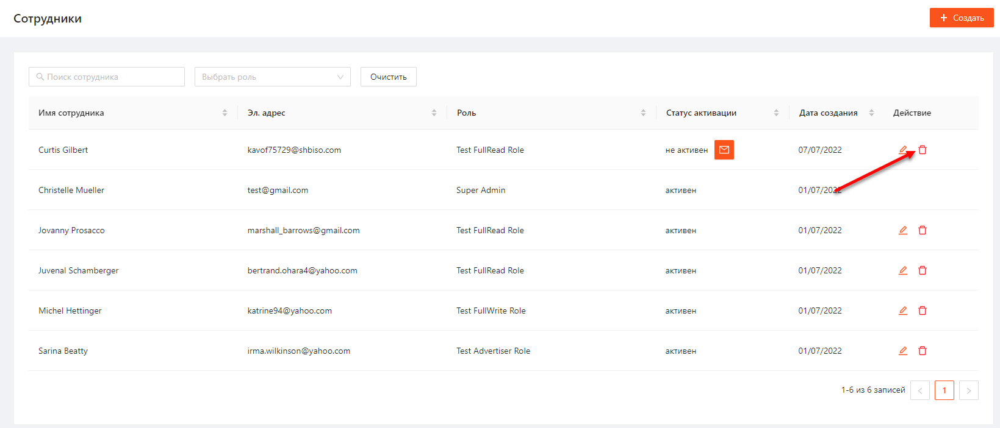
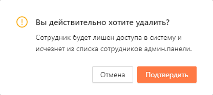
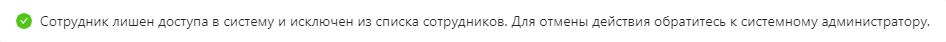

1. [Просмотр списка сотрудников](#просмотр-списка-сотрудников)
2. [Создание нового сотрудника](#создание-нового-сотрудника)
3. [Редактирование сотрудника](#редактирование-сотрудника)
4. [Удаление сотрудника](#удаление-сотрудника)

# Просмотр списка сотрудников
Для того чтобы перейти к списку сотрудников необходимо в боковом меню нажать на раздел «Сотрудники» и в раскрывшемся списке выбрать «Просмотр».
Список сотрудников представлен в виде таблицы (Рисунок 1) с параметрами:
- Имя сотрудника
- Эл. адрес
- Роль
- Статус активации:
	- активен
	- не активен
- Дата создания
- Действие:
	- Изменить
	- Удалить

Рисунок 1

Список можно отфильтровать по Имени сотрудника и Роли.  
Отсортировать список можно по всем параметрам.

# Создание нового сотрудника
Для создания нового сотрудника необходимо выполнить следующие шаги:
1. На странице просмотра списка сотрудников нажать кнопку "Создать" (Рисунок 2).
   
   
   
   Рисунок 2  
2. В открывшемся окне создания роли заполнить поля Имя, Эл. адрес, Роль и нажать "Сохранить" (Рисунок 3):
   
   
   
   Рисунок 3

После успешного сохранения отобразится уведомление, подтверждающее создание сотрудника (Рисунок 4).

Рисунок 4

В списке сотрудников добавится новая запись с созданным сотрудником в статусе Не активен.
Для активации аккаунта сотруднику необходимо завершить регистрацию следуя инструкциям в письме отправленном на указанный эл. адрес.

Если сотрудник находится в статусе Не активен, сотрудник админ. панели может повторно выслать ему приглашение на эл. почту. Для этого необходимо нажать на кнопку отправки письма справа от статуса (Рисунок 5).

Рисунок 5

После успешной повторной отправки письма отобразится уведомление (Рисунок 6).

Рисунок 6

# Редактирование сотрудника
Для редактирования сотрудника необходимо выполнить следующие шаги:
1. Нажать на кнопку "Изменить" напротив необходимого сотрудника на странице просмотра списка сотрудников (Рисунок 7).
   
   
   
   Рисунок 7  
2. В открывшемся окне отредактировать необходимые поля и нажать кнопку «Сохранить» (Рисунок 8).
   
   
   
   Рисунок 8

После успешного сохранения отобразится уведомление, подтверждающее изменение сотрудника (Рисунок 9).

Рисунок 9

Данные сотрудника с ролью Super Admin недоступны для редактирования.

# Удаление сотрудника
Для удаления сотрудника необходимо выполнить следующие шаги:
1. Нажать на кнопку "Удалить" напротив необходимого сотрудника на странице просмотра списка сотрудников (Рисунок 10).
   
   
   
   Рисунок 10
2. В открывшемся модальном окне нажать "Подтвердить" (Рисуноок 11).
   
   
   
   Рисунок 11

После успешного удаления отобразится подтвержждающее уведомление (Рисунок 12).

Рисунок 12

Сотрудника с ролью Super Admin удалить нельзя.