1. [Просмотр списка ролей](#просмотр-списка-ролей)
2. [Просмотр роли](#просмотр-роли)
3. [Создание новой роли](#создание-новой-роли)
4. [Редактирование роли](#редактирование-роли)
5. [Удаление роли](#удаление-роли)

# Просмотр списка ролей
Для того чтобы перейти к списку ролей необходимо в боковом меню нажать на раздел «Сотрудники» и в раскрывшемся списке выбрать «Роли».
Список ролей представлен в виде таблицы (Рисунок 1) с параметрами:
- Название
- Дата создания
- Действие:
	- Изменить
	- Удалить

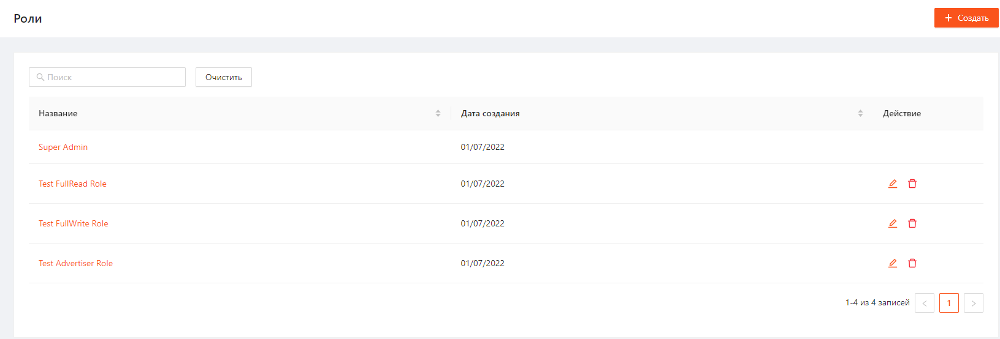

Рисунок 1

Список можно отфильтровать по Названию, отсортировать по Названию и Дате создания.

# Просмотр роли
Чтобы посмотреть карточку роли необходимо нажать на Название роли.
После этого откроется карточка для просмотра деталей выбранной роли (Рисунок 2).

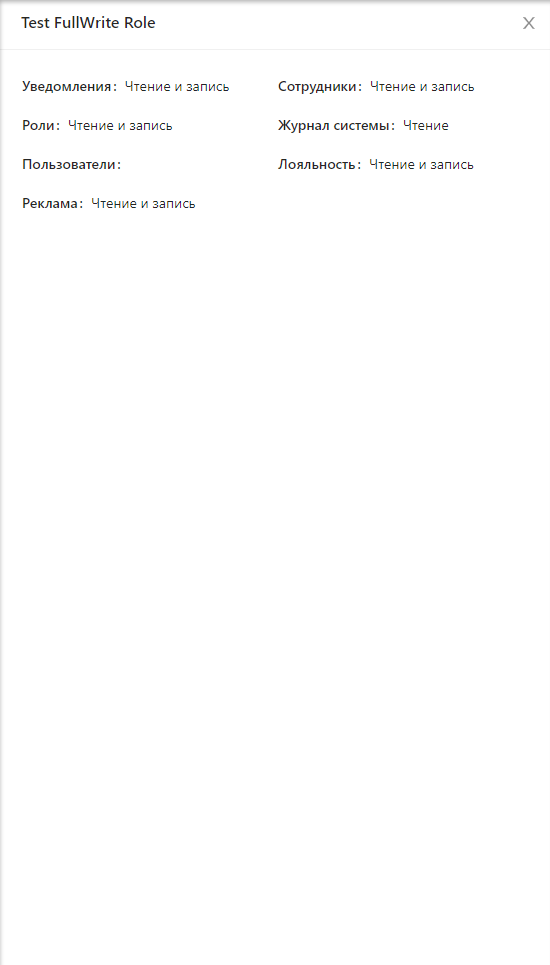

Рисунок 2

В карточке отображается перечень доступных прав для выбранной роли.

В системе есть роль Super Admin. У этой роли есть полный доступ ко всем разделам системы с правом на чтение и запись.
Ее нельзя редактировать и удалять.
Карточка роли Super Admin выглядит следующим образом:

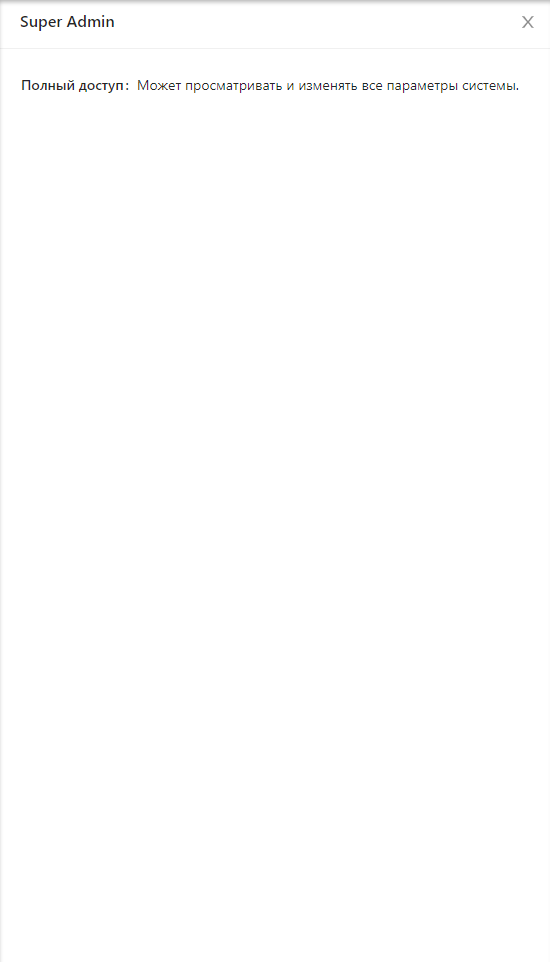

Рисунок 3

# Создание новой роли
Для создания новой роли необходимо выполнить следующие шаги:
1. На странице просмотра списка ролей нажать кнопку "Создать" (Рисунок 4).
   
   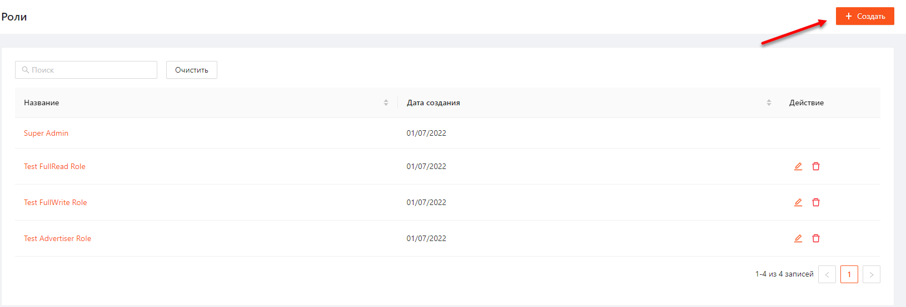
   
   Рисунок 4     
2. В открывшемся окне создания роли заполнить обязательное поле Название роли и настроить права для каждого раздела (Рисунок 5):
	1. "Нет прав" - пользователю не отображается раздел;
	2. "Чтение" - пользователь может только просмотреть раздел;
	3. "Чтение и запись" - пользователь может просматривать раздел и вносить изменения: создавать, редактировать, удалять сущности раздела.
3. Нажать кнопку "Сохранить".

   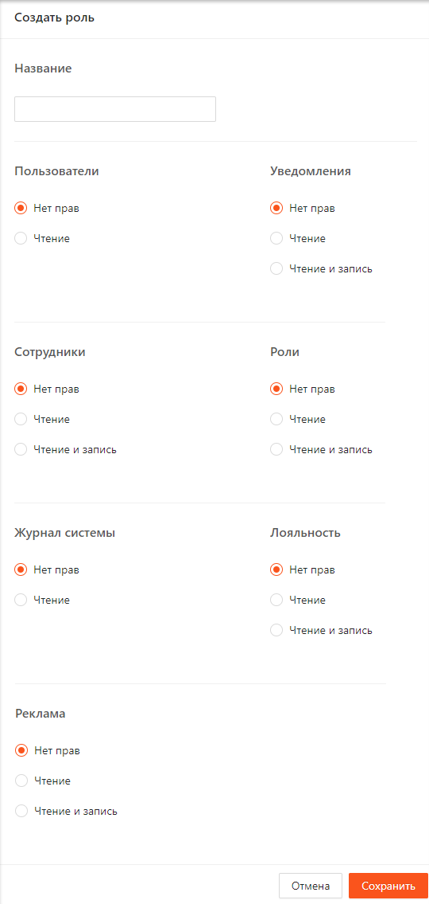

Рисунок 5

После успешного сохранения отобразится уведомление, подтверждающее создание роли (Рисунок 6).

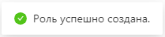

Рисунок 6

# Редактирование роли
Для редактирования роли необходимо выполнить следующие шаги:
1. Нажать на кнопку "Изменить" напротив необходимой роли на странице просмотра списка ролей (Рисунок 7).
   
   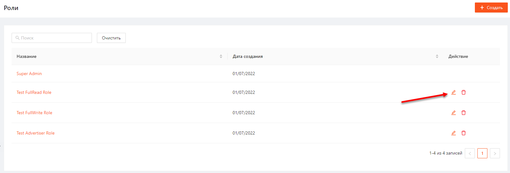
   
   Рисунок 7     
2. В открывшемся окне отредактировать необходимые поля и нажать кнопку «Сохранить» (Рисунок 8).
   
   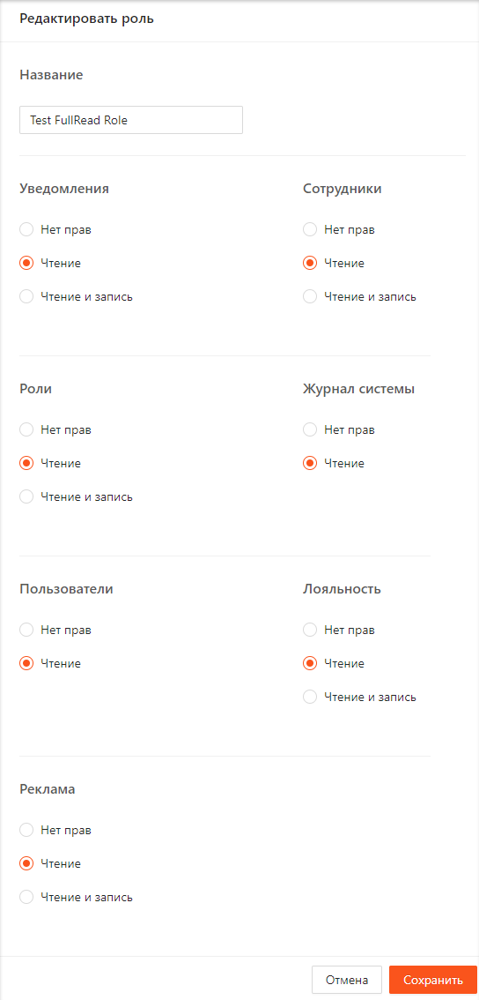
   
   Рисунок 8

После успешного сохранения отобразится уведомление, подтверждающее изменение роли (Рисунок 9).

Рисунок 9

Роль Super Admin недоступна для редактирования.

# Удаление роли
Для удаления роли необходимо выполнить следующие шаги:
1. Нажать на кнопку "Удалить" напротив необходимой роли на странице просмотра списка ролей (Рисунок 10).
   
   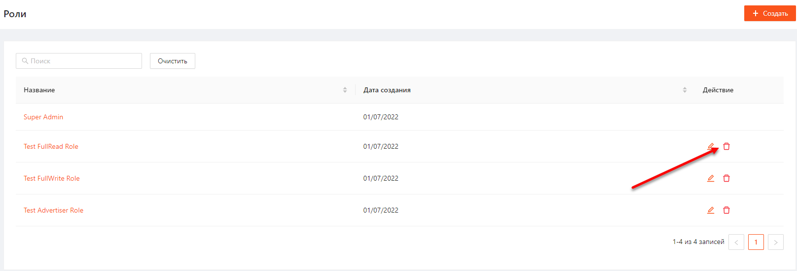
   
   Рисунок 10
   
2. В открывшемся модальном окне нажать "Подтвердить" (Рисуноок 11).
   
   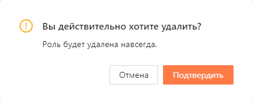
   
   Рисунок 11

После успешного удаления отобразится подтвержждающее уведомление (Рисунок 12).

Рисунок 12

Если роль назначена хотя бы на одного пользователя, ее удалить нельзя, при нажатии на кнопку "Подтвердить" удаление не произойдет и отобразится уведомление (Рисунок 13):

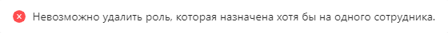

Рисунок 13

Роль Super Admin удалить нельзя.