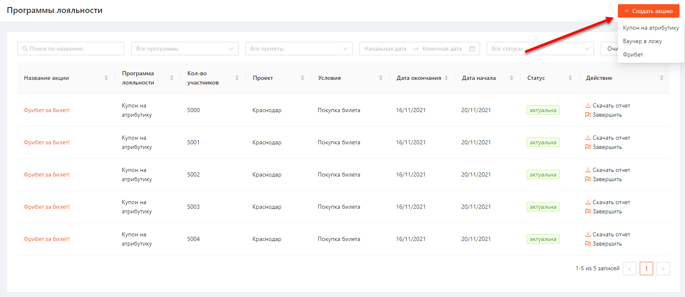

1. [Просмотр списка акций](#просмотр-списка-акций)
	1. [Статусы и доступные действия](#статусы-и-доступные-действия)
2. [Просмотр информации об акций](#просмотр-информации-об-акции)
3. [Создание акции](#создание-акции)
	1. [Шаг 1. Общее](#шаг-1-общее)
	2. [Шаг 2. Условия акции](#шаг-2-условия-акции)
	3. [Шаг 3. Награда](#шаг-3-награда)

# Просмотр списка акций
Для того чтобы перейти к списку акций необходимо в боковом меню выбрать раздел «Лояльность».
Список акций представлени в виде таблицы (Рисунок 1) с параметрами:
- Название акции
- Программа лояльности
- кол-во участников
- Проект
- Условия
- Дата окончания
- Дата начала
- Статус
- Действие:
	- Изменить
	- Завершить
	- Скачать отчет
	- Удалить

Рисунок 1

Список акций можно отфильтровать по параметрам:
- Название акции
- Программа лояльности
- Проект
- Период проведения программы лояльности
- Статус

Отсортировать список можно по всем параметрам.

## Статусы акций и доступные действия
В системе существует 4 типа статусов акции:
1. "Запланирована". Акция создана, время публикации еще не наступило.
   Доступные действия:
   - Изменить
   - Завершить
   - Удалить
2. "Опубликована". Наступает время публикации созданной акции.
   Доступные действия:
   - Изменить
   - Завершить
   - Удалить
3. "Завершена". Наступает время окончания акции.
   Доступные действия:
   - Скачать отчет
   - Удалить
4. "Завершена досрочно". Кол-во победителей превысило кол-во наград.
   Доступные действия:
   - Скачать отчет
   - Удалить

# Просмотр информации об акции
Чтобы посмотреть информацию об акции необходимо нажать на Название акции.  
После этого откроется карточка для просмотра информации о выбранной акции (Рисунок 2).

Рисунок 2

# Создание акции
Для создания акции необходимо выполнить следующие шаги:
1. Нажать на кнопку "Создать" и выбрать в выпадающем списке тип акции (Рисунок 3):
   - Купон на атрибутику
   - Ваучер в ложу
   - Фрибет
   
   
   
   Рисунок 3 
2. Пользователь переходит к созданию акции, которое состоит из 3 шагов.

## Шаг 1. Общее
На данном шаге необходимо заполнить общие сведения об акции (Рисунок 4). Набор полей одинаковый для всех типов акций.

*скрин winline_loyalty_4*

Рисунок 4.

## Шаг 2. Условия акции
На данном шаге необходимо заполнить условия выполнения акции (Рисунок 5). Набор полей одинаковый для всех типов акций.

*скрин winline_loyalty_5*

Рисунок 5.

## Шаг 3. Награда
На данном шаге необходимо указать тип акции выбранный при создании.
Далее, в зависимости от выбранного типа акции, необходимо заполнить данные о награде за выполнение условий.

Награда для акции "Купон на атрибутику"

*скрин winline_loyalty_6*

Рисунок 6.

Награда для акции "Ваучер в ложу"

*скрин winline_loyalty_7*

Рисунок 7.

Награда для акции "Фрибет"

*скрин winline_loyalty_8*

Рисунок 8.