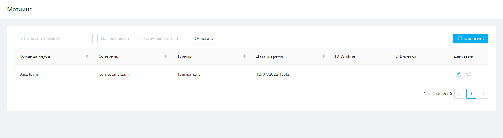
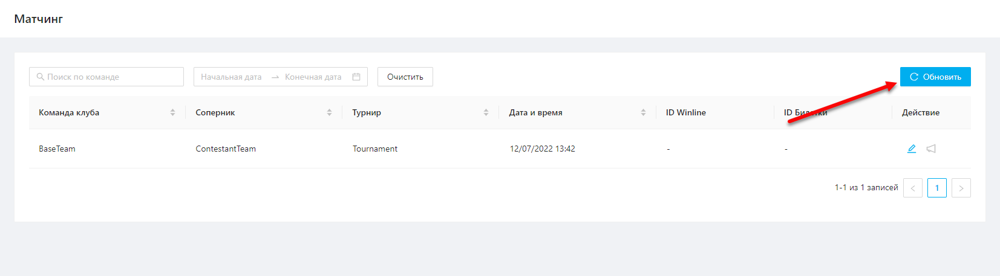
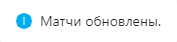
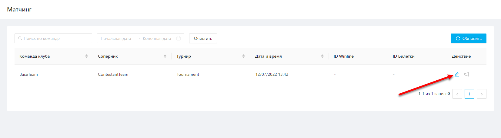
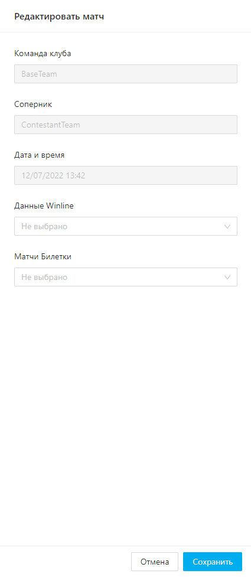
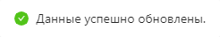
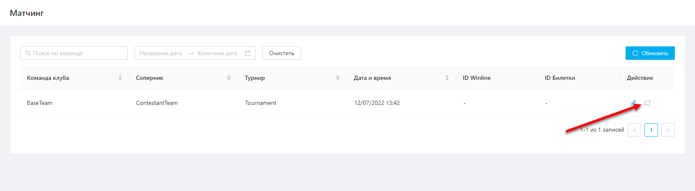

1. [Просмотр списка матчей](#просмотр-списка-матчей)
	1. [Обновление списка матчей](#обновление-списка-матчей)
2. [Матчинг матча](#матчинг-матча)
3. [Отправка push уведомления о старте продажи билетов](#отправка-push-уведомления-о-старте-продажи-билетов)

# Просмотр списка матчей
Для того чтобы перейти к списку матчей необходимо в боковом меню выбрать раздел «Матчинг».  

В разделе "Матчинг" отображается список всех матчей команды. Сотрудник админ. панели может связать выбранный матч с конкретным событием билетной системы или фида с коэффициентом Winline. 

Список матчей представлен в виде таблицы (Рисунок 1) с параметрами:
- Команда клуба
- Соперник
- Турнир
- Дата и время
- ID Winline
- ID Билетки
- Действие:
	- Изменить
	- PUSH о старте продажи билетов

Рисунок 1

Отфильтровать список матчей можно по параметрам:
- Команда клуба
- Период проведения матча

Отсортировать список можно по параметрам:
- Команда клуба
- Соперник
- Турнир
- Дата и время

## Обновление списка матчей
Для получения актуального списка матчей сотрудник админ. панели может обновить список матчей нажав на кнопку "Обновить" (Рисунок 2).

Рисунок 2

После успешного обновления списка матчей отобразится соответствующее уведомление (Рисуснок 3).

Рисунок 3

# Матчинг матча
Чтобы произвести матчинг данных по матчу из Билетки и Winline необходимо выполнить следующие шаги:
1. Нажать на кнопку "Изменить" напротив необходимого матча на странице просмотра списка матчей (Рисунок 4).
   
   
   
   Рисунок 4  
2. В открывшемся окне выбрать необходимый матч в полях "Данные Winline" и "Матчи Билетки" (Рисунок 5).

   
   
   Рисунок 5

После успешного сохранения отобразится уведомление, подтверждающее обновление данных (Рисунок 6).

Рисунок 6

# Отправка push уведомления о старте продажи билетов
Если по матчу сопоставлен ID Билетки, то сотрудник админ. панели может отправить push-уведомление пользователям о старте продажи билетов.

Чтобы отправить push-уведомление пользователям необходимо нажать на кнопку "PUSH о старте продажи билетов" напротив необходимого матча на странице просмотра списка матчей (Рисунок 7).

Рисунок 7