1. [Просмотр списка игроков](#просмотр-списка-игроков)
2. [Просмотр информации об игроке](#просмотр-инофрмации-об-игроке)
3. [Редактирование игрока](#редактирование-игрока)
4. [Удаление игрока](#удаление-игрока)

# Просмотр списка игроков
Для того чтобы перейти к списку игроков необходимо в боковом меню выбрать раздел «Игроки».
Список ролей представлен в виде таблицы (Рисунок 1) с параметрами:
- ID игрока
- ФИО
- Сезон
- Дата рождения
- Амплуа
- Игровой номер
- Команда
- Действие:
	- Изменить
	- Удалить

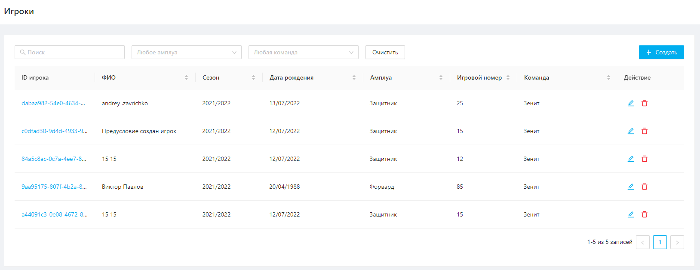

Рисунок 1

Отфильтровать список можно по парааметрам:
- ФИО
- Амплуа
- Команда

Отсортировать список можно по парааметрам:
- ФИО
- Сезон
- Дата рождения
- Амплуа
- Игровой номер
- Команда

# Просмотр информации об игроке
Чтобы посмотреть информацию об игроке необходимо нажать на ID игрока.  
После этого откроется карточка для просмотра информации о выбранном игроке (Рисунок 2).

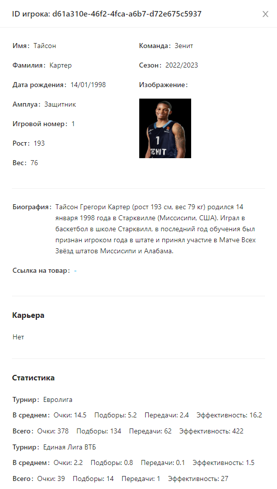

Рисунок 2

# Создание игрока
Для создания уведомления необходимо выполнить следующие шаги:
1. На странице просмотра списка игроков нажать кнопку "Создать" (Рисунок 3).
   
   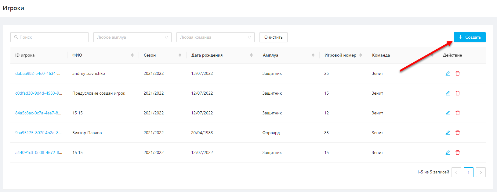
   
   Рисунок 3  
2. В открывшемся окне создания игрока (Рисунок 4) заполнить все обязательные поля и нажать "Сохранить".
   
   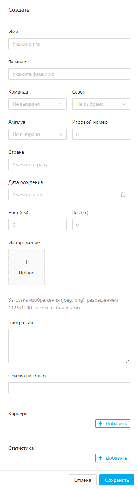
   
   Рисунок 4

После успешного сохранения отобразится уведомление, подтверждающее создание игрока (Рисунок 5).

 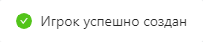

Рисунок 5

# Редактирование игрока
Для редактирования игрока необходимо выполнить следующие шаги:
1. Нажать на кнопку "Изменить" напротив необходимого игрока на странице просмотра списка игроков (Рисунок 6).
   
   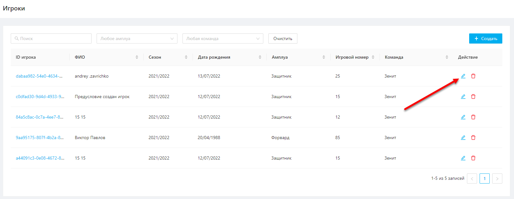
   
   Рисунок 6  
2. В открывшемся окне отредактировать необходимые поля и нажать кнопку «Сохранить» (Рисунок 7).
   
   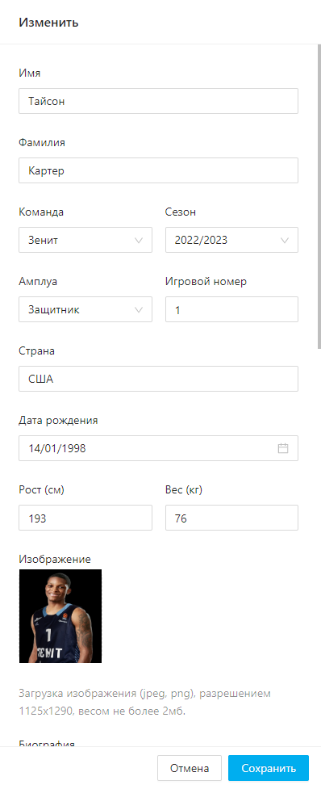
   
   Рисунок 7

После успешного сохранения отобразится уведомление, подтверждающее изменение игрока (Рисунок 9).

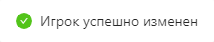

Рисунок 8

# Удаление игрока
Для удаления игрока необходимо выполнить следующие шаги:
1. Нажать на кнопку "Удалить" напротив необходимого игрока на странице просмотра списка игроков (Рисунок 9).
   
   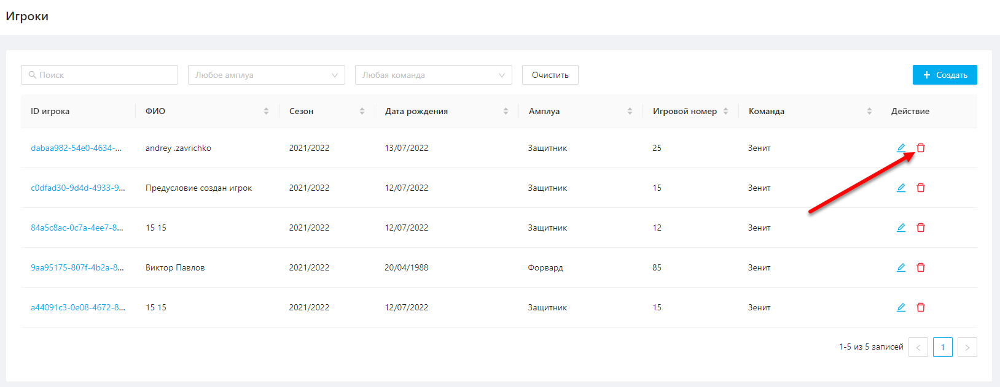
   
   Рисунок 9  
2. В открывшемся модальном окне нажать "Подтвердить" (Рисунок 10).

   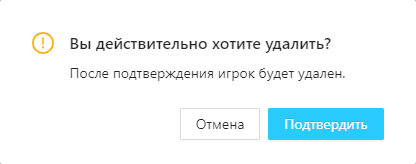
   
   Рисуок 10

После успешного удаления отобразится подтвержждающее уведомление (Рисунок 11).

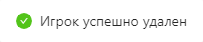

Рисунок 11