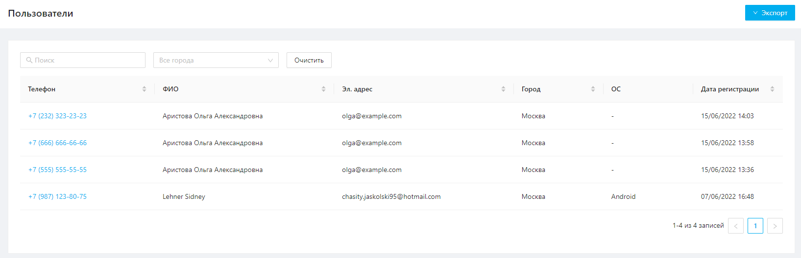
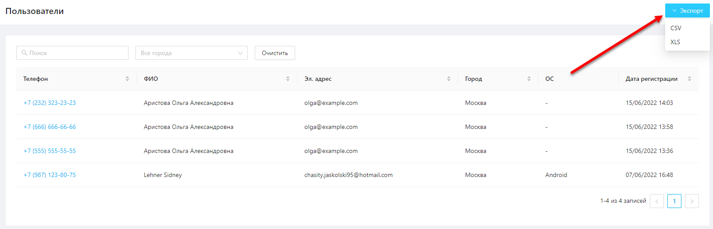
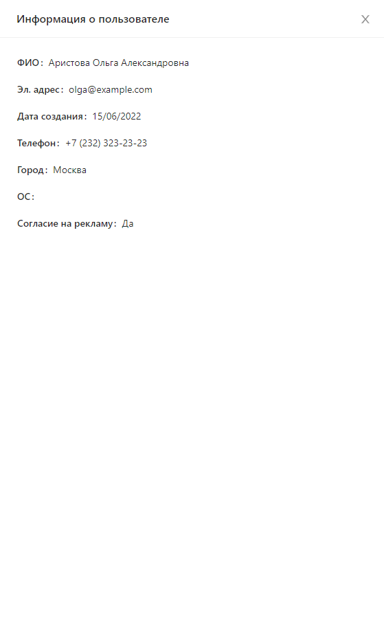

1. [Просмотр списка пользователей](#просмотр-списка-пользователей)
	1. [Экспорт списка пользователей](#экспорт-списка-пользователей)
2. [Просмотр информации о пользователе](#просмотр-информации-о-пользователе)

# Просмотр списка пользователей
Для того чтобы перейти к списку пользователей необходимо в боковом меню нажать на раздел «Пользователи» и в раскрывшемся списке выбрать «Просмотр».
Список пользователей представлен в виде таблицы (Рисунок 1) с параметрами:
- Телефон
- ФИО
- Эл. адрес
- Город
- ОС
- Дата регистрации

Рисунок 1

Список можно отфильтровать по параметрам:
- Телефон
- ФИО
- Эл. адрес
- Город

Отсортировать список можно по параметрам:
- Телефон
- ФИО
- Эл. адрес
- Город
- Дата регистрации

## Экспорт списка пользователей
Список пользователей можно экспортировать в файл формата CSV или XLS. Для этого необходимо нажать на кнопку "Экспор" в правом верхнем углу экрана и выбрать формат файла (Рисунок 2).

Рисунок 2

После выбора формата для экспорта отобразится уведомление, подтверждающее сохранение файла (Рисунок 3).

Рисунок 3

# Просмотр информации о пользователе
Чтобы посмотреть информацию о пользователе необходимо нажать на Телефон пользователя .  
После этого откроется карточка для просмотра информации о выбранном пользователе (Рисунок 4).

Рисунок 4